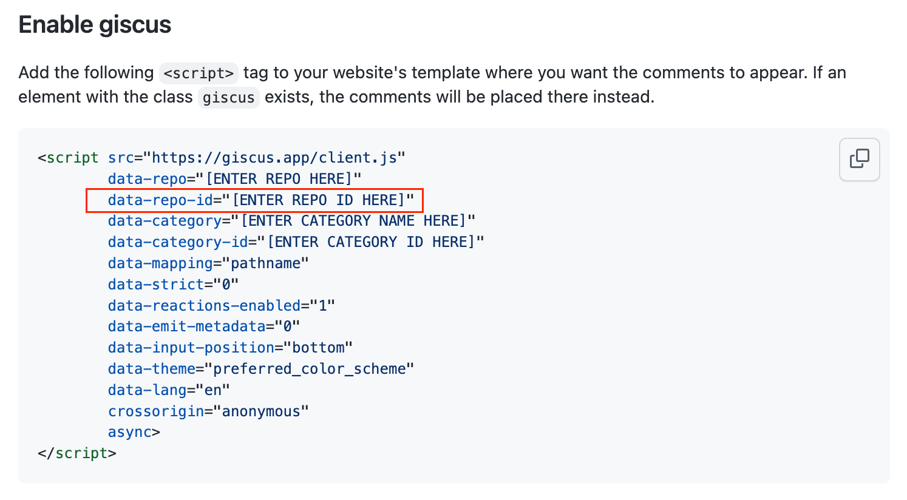

# Pure

> It's a blog based on github discussion that lets you focus on your creativity. All you need to do is open your browser, log in to github and start your creative journey, no more worry about file, sync deployment and image uploads. What's more  you can migrate your blog in the way you like!

Notes: **For standard deployment, please refer to the [master](https://github.com/LeetaoGoooo/pure/tree/master) branch**

# Deploy To Vercel

Before you do a deployment, you need to config `BlogConfig` in `constants.go` 

Get your own [GITHUB_ACCESS_TOKEN](https://github.com/settings/tokens) here

## comments

pure use [gitcus](https://github.com/giscus/giscus) as comment system, visit [gitcus-website](https://giscus.app/) to get your repo id ,which can be found in `data-repo-id`

# Screens

<image src="./screens/homepage.png" width="300"/><image src="./screens/postpage.png" width="300"/>
